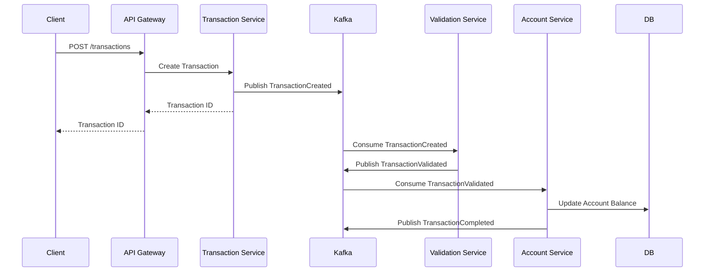

# Transactions: Микросервисное решение для финансовых операций

<div align="center">
  
  
  
  
  
  
</div>

<div align="center">
  
</div>

## 📋 Описание

**Transactions** — это современное микросервисное решение для обработки финансовых транзакций, разработанное с применением принципов Event-Driven архитектуры. Проект демонстрирует построение масштабируемой и отказоустойчивой системы на базе .NET Core и контейнерных технологий с использованием Apache Kafka в качестве платформы обмена сообщениями.

### 🌟 Ключевые возможности

- **Высокая пропускная способность** обработки финансовых операций
- **Горизонтальное масштабирование** для роста нагрузки
- **Отказоустойчивость** за счет асинхронного взаимодействия
- **Распределенная трассировка** запросов через микросервисы
- **Event-driven модель** для слабого связывания компонентов

## 🏗️ Архитектура

Система построена на основе современной микросервисной архитектуры:

<table>
  <tr>
    <td align="center"><br/><b>API Gateway</b></td>
    <td>Централизованная точка входа, обеспечивающая маршрутизацию и аутентификацию запросов</td>
  </tr>
  <tr>
    <td align="center"><br/><b>Aggregator</b></td>
    <td>Сервис для сбора и агрегации данных из различных микросервисов</td>
  </tr>
  <tr>
    <td align="center"><br/><b>Domain</b></td>
    <td>Ядро системы, содержащее бизнес-логику и доменные модели</td>
  </tr>
  <tr>
    <td align="center"><br/><b>Common</b></td>
    <td>Библиотека общих компонентов и утилит</td>
  </tr>
  <tr>
    <td align="center"><br/><b>ESB Adapter</b></td>
    <td>Адаптер для интеграции с корпоративной сервисной шиной</td>
  </tr>
</table>

## 🛠️ Технологический стек

<table>
  <tr>
    <td>&nbsp; <b>C#</b></td>
    <td>Основной язык программирования</td>
  </tr>
  <tr>
    <td>&nbsp; <b>.NET Core</b></td>
    <td>Кроссплатформенный фреймворк для создания микросервисов</td>
  </tr>
  <tr>
    <td>&nbsp; <b>Apache Kafka</b></td>
    <td>Распределенная платформа обработки событий для асинхронной коммуникации</td>
  </tr>
  <tr>
    <td>&nbsp; <b>Docker</b></td>
    <td>Контейнеризация приложений и сервисов</td>
  </tr>
  <tr>
    <td>&nbsp; <b>PostgreSQL</b></td>
    <td>Хранение данных о транзакциях и бизнес-сущностях</td>
  </tr>
</table>

## 🚀 Запуск проекта

### Предварительные требования

- Docker
- Docker Compose
- .NET Core SDK 6.0+

### Шаги для запуска

1. **Клонирование репозитория**

```bash
git clone https://github.com/maksimkayun/transactions.git
cd transactions
```

2. **Запуск с использованием Docker Compose**

```bash
docker-compose up --build
```

Это развернет все необходимые сервисы, включая:
- Микросервисы приложения
- PostgreSQL базу данных
- Apache Kafka для обмена сообщениями
- Schema Registry для управления схемами сообщений
- Инструменты мониторинга

3. **Доступ к API**

API будет доступен по адресу: `http://localhost:5000`

### Запуск тестов

```bash
dotnet test
```

## 📈 Системные требования и производительность

- **Минимальные требования**: 2 CPU, 4 GB RAM для запуска в режиме разработки
- **Рекомендуемые**: 4+ CPU, 8+ GB RAM для продакшн-окружения
- **Производительность**: Обработка до 1000 транзакций в секунду на одном узле

## 📊 Примеры использования

```csharp
// Пример создания новой транзакции через API
var transactionRequest = new TransactionRequest
{
    Amount = 1500.50m,
    Currency = "USD",
    SourceAccountId = "ACC123456",
    DestinationAccountId = "ACC789012",
    Description = "Monthly payment"
};

var response = await httpClient.PostAsJsonAsync("/api/transactions", transactionRequest);
var transactionId = await response.Content.ReadFromJsonAsync<string>();
```

## 📋 Документация API

| Endpoint | Метод | Описание |
|----------|-------|----------|
| `/api/transactions` | POST | Создание новой транзакции |
| `/api/transactions/{id}` | GET | Получение информации о транзакции |
| `/api/transactions/accounts/{accountId}` | GET | Получение всех транзакций по счету |
| `/api/reports/daily` | GET | Получение отчета за день |

## 🔄 Диаграмма последовательности для обработки транзакции



## 📜 Лицензия

Проект распространяется под лицензией MIT.
---

<div align="center">
  <sub>Построено с ❤️ в России</sub>
</div>
